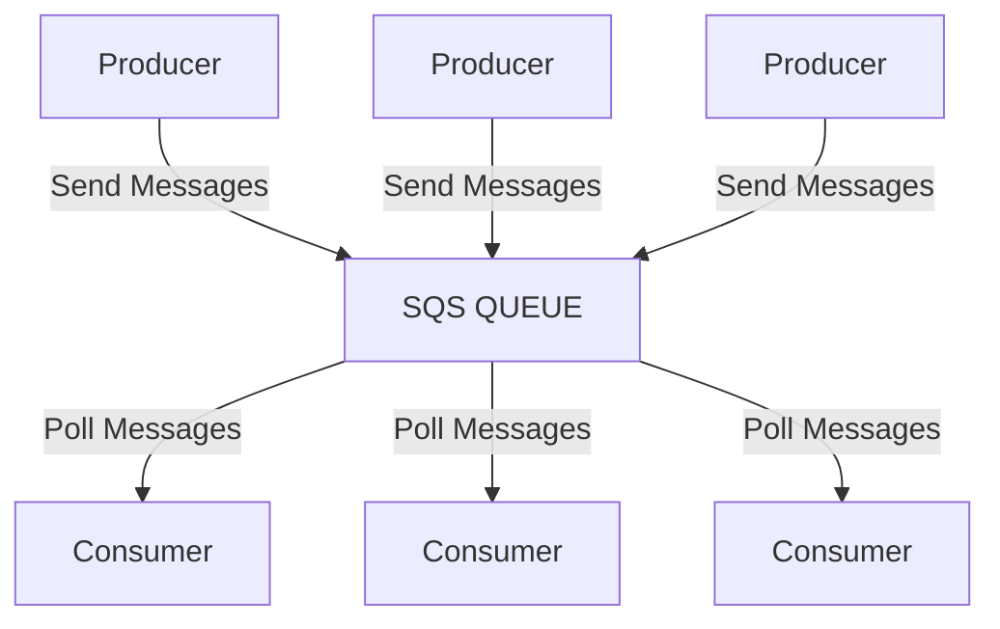

# Cloud Integrations
- Synchronous communication between applications can be problematic if there are sudden spike of traffic
- What if we need to suddenly encode 1000 videos but usually it's 10.
- In that case, it's better to decouple your applications:
  - use SQS: queue model
  - use SNS: pub/sub model
  - using Kinesis: realtime data streaming model
- These services can scale independently from our application.

## Amazon SQS
It is a fully managed message queuing service that enables decoupling and scaling microservices, distributed systems, and serverless applications. It supports standard (high throughput, at-least-once delivery) and FIFO queues to manage message flow reliably.

### Key Features and Capabilities
- **Decoupling**: Allows components to function independently, improving fault tolerance.
- **Message Retention**: Stores messages up to 14 days, with payloads up to 256KB
- **Scalability**: Handles any volume of messages without provisioning
- **FIFO Queues**: Ensures strict ordering and prevents duplicates, ideal for tasks like banking transactions or e-commerce orders
- **Dead-Letter Queues (DLQ)**: Supports handling failed messages.
- **Batching**: Enables sending, receiving, or deleting up to 10 messages in one batch to improve cost-efficiency.

---

## Amazon SNS
Amazon Simple Notification Service (SNS) is a fully managed, high-speed, push-based messaging service for pub/sub communication and application-to-person (A2P) notifications.

It enables instantaneous, asynchronous delivery of messages to multiple endpoints, including SMS, email, Lambda functions, and Amazon SQS queues. SNS supports both standard and FIFO topics

### Key Features and Capabilities
- **Pub/Sub Messaging**: Publisher send messages to a topic, which then distributes them to subscribers
- **Message Filtering**: Subscribers can set policies to receive only the specific messages they are interested in, simplifying subscriber logic.
- **Topic Types**:
  - **Standard**: Provides high throughput, best-effort ordering, and at-least-once delivery.
  - **FIFO**: Ensures strict message ordering and exactly-once delivery.
- **Message Fanout**: A single message published to a topic can be sent to thousands of subscribers simultaneously.
- **Security & Reliability**: Features in-transit encryption (default) and optional at-rest encryption via KMS. It also includes built-in retry policies and supports Dead-Letter Queues for handling delivery failures.

---

## Amazon Kinesis
Amazon Kinesis is a managed AWS service designed to ingest, process and analyze real-time, large-scale steaming data, such as IoT telemetry, click streams, and application logs.

It allows for instant analytics, bypassing the need for batch processing.

### Key Components
- **Amazon Kinesis Data Streams (KDS)**
- **Amazon Kinesis Data Firehose**
- **Amazon Kinesis Data Analytics**
- **Amazon Kinesis Video Streams**

---

## Amazon MQ (Message Queue)
- SQS, SNS are "cloud-native" services: proprietary protocols from AWS
- Traditional applications running from on-premises may use open protocols such as: MQTT, AMQP, STOMP, OpenWire, WSS ..
- When migrating to the cloud, instead of re-engineering the application to use SQS and SNS, we can use Amazon MQ
- Amazon MQ is a managed message broker service for RabbitMQ and ActiveMQ
- Amazon MQ doesn't scale as much as SQS/SNS
- Amazon MQ runs on server can run in Multi-AZ with failover
- Amazon MQ has both queue feature (~SQS) and topic features (~SNS)