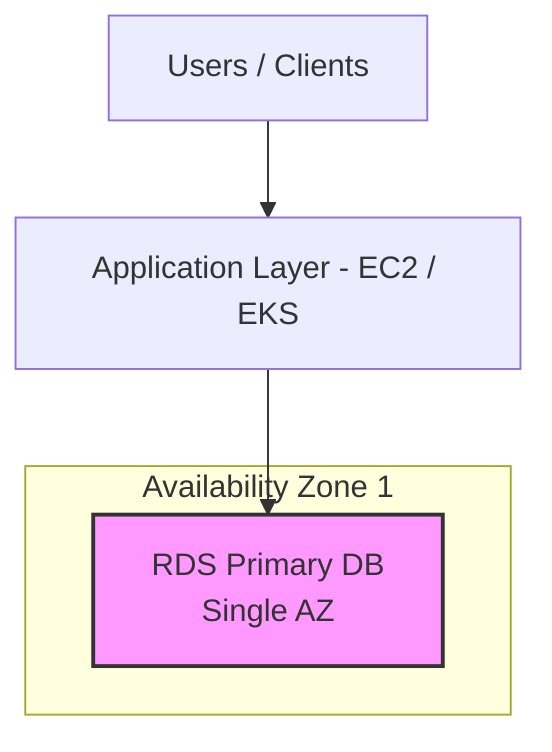
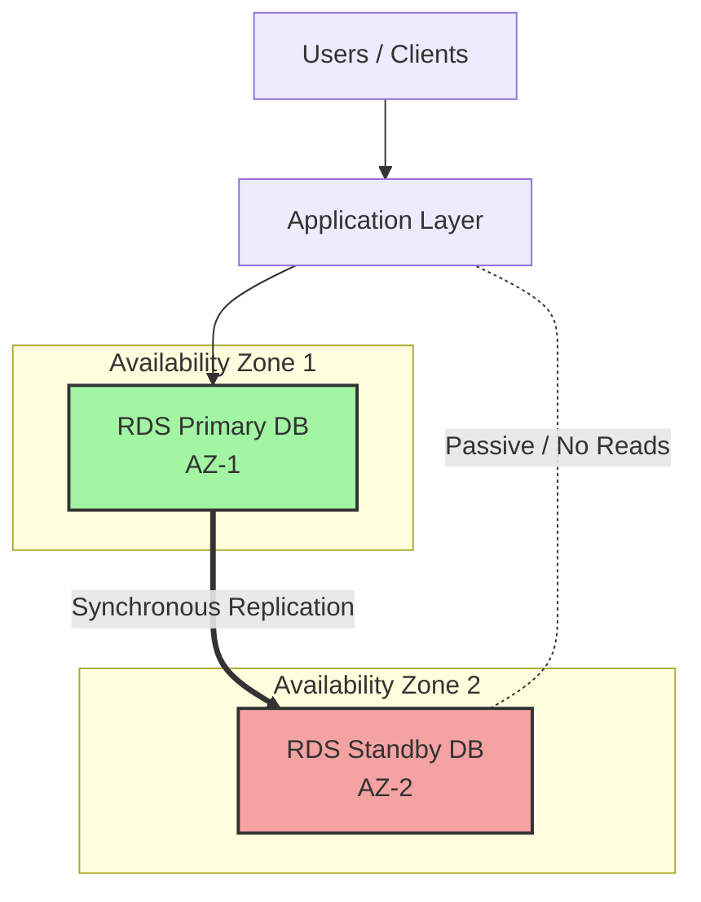
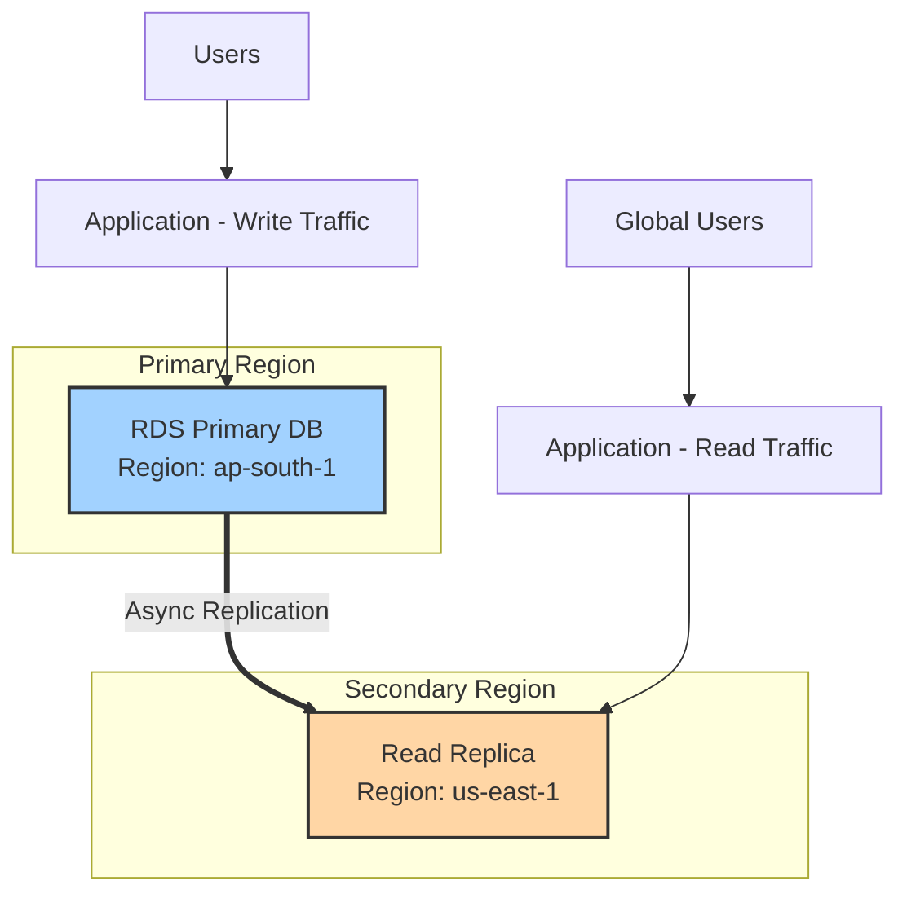
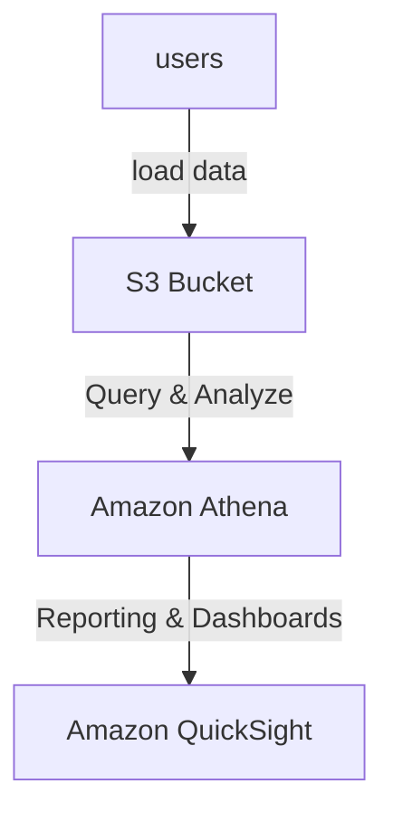
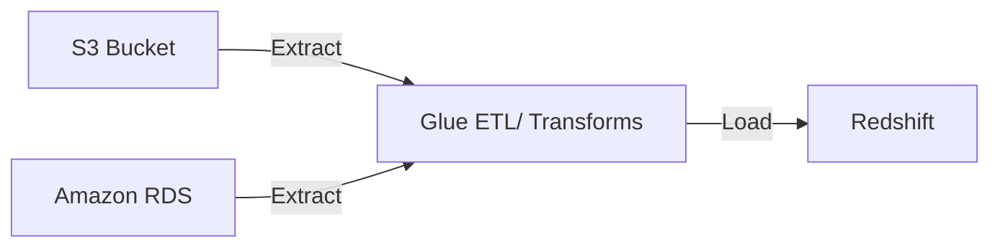
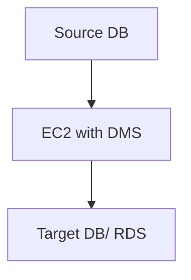

# Databases in AWS

### Databases & Shared responsibility on AWS
- AWS offers use to manage different databases
- Benefits include:
  - Quick provisioning, High Availability, Vertical & Horizontal Scaling
  - Automated Backup & Restore, Operations, Upgrades
  - Operating System Patching is handled by AWS
  - Monitoring , alerting
- Note: many database technologies could be run on EC2, but you must handle yourself the resilience, backup, patching, HA, fault tolerance, scaling...
- It is a Platform as a Service model, which means AWS manages the underlying infrastructure and OS, freeing you from administrative overhead.

### AWS RDS
Amazon RDS is a fully managed cloud service that simplifies the setup, operation, and scaling of relational databases. Ih handles routine administration tasks like provisioning, patching, backup, recovery and failure detection, allowing users to focus on application development.

#### Key Features & Concepts
- **Supported Databases**: Amazon RDS is compatible with several popular database engines, so you can use existing code, applications, and tools.
  - Amazon Aurora (AWS's high-performance, MySQL & PostgreSQL compatible engine)
  - PostgreSQL
  - MySQL
  - MariaDB
  - Oracle
  - Microsoft SQL Server
  - IBM DB2
- **Managed Administration Tasks**: AWS automates much of the heavy lifting, including:
  - Automated backups with point-in-time recovery and user-initiated snapshots
  - Automatic Software patching and upgrades
  - Multi-AZ deployments for HA and DR, which synchronously replicate data to a standby instance in a different AZ.
  - Storage auto-scaling to dynamically increase database storage as needed, which zero downtime.
  - Performance monitoring through Amazon CloudWatch and Performance Insights
- **Scalability and Performance**:
  - *Vertical Scaling*: Easily scale the compute (CPU and memory) resources of your DB instance up or down using the AWS Management Console or APIs
  - *Horizontal Scaling*: Create read-only copies of your primary database to server high-volume read traffic, offloading the primary instance.
  - *Storage Options*: Choose from General Purpose SSD, Provisioned IOPS SSD, or magnetic storage depending on your performance needs.
- **Security**: RDS provides robust security features, including network isolation within an AWS VPC, encryption at rest using AWS KMS and encryption of data in-transit using SSL.

### Amazon Aurora
It is a fully managed, high-performance relational database engine built for the cloud, compatible with MySQL and PostgreSQL. It combines the speed and availability of high-end commercial databases with the cost-effectiveness of open-source databases, offering up to 5z faster performance than standard MySQL and 3X faster than standard PostgreSQL,

Key Features of Aurora include
- **Performance & Scalability**: Designed for high-throughput, featuring a distributed, fault-tolerant, self-healing storage system that auto-scales up to 128YiB per database instance.
- **High Availability**: Automatically replicates 6 copies of data across three AZs and provides fast failover.
- **Fully Managed**: Handled by Amazon RDS, automating time-consuming tasks like provisioning, patching, backup and recovery.
- **Compatibility**: Fully compatible with MySQL & PostgreSQL, allowing existing applications to run without modifications.
- **Aurora Serverless**: An option that automatically scales compute capacity up or down based on application demand.

### RDS Deployment Options
Amazon RDS offers three main deployment options tailored for different needs: Single AZ for development (no redundancy), Multi-AZ with one standby for HA, and Multi-AZ with two readable standbys.

#### Single-AZ deployment
A single database instance in one Availability Zone. Ideal for development, testing, or scenarios where HA is not required. Data is not replicated across zones.

#### Multi-AZ DB Instance (One Standby): 
Synchronous replication to a standby instance in a different AZ, providing automatic failover and high durability for production workloads

#### Multi-AZ DB Cluster (Two Readable Standbys)
uses two readable standby instances across three AZs to improve read-performance, provide lower failover times and enhance transaction commit times

#### Cross Region Read Replicas
Asynchronous replicas used primarily to scale read traffic away from the primary instance or for disaster recovery.

---

## Amazon ElastiCache
Amazon ElastiCache is a fully managed, in-memory data store and caching service that boosts web application performance by retrieving data from fast, managed memory rather than slower disk-based databases. It supports Valkey, Redis OSS, and memcached, providing sub-millisecond latency for use cases like database caching, session management and real-time analytics.

### Key features and benefits
- **Performance**: Drastically reduces latency and offloads load from primary databases
- **Full Managed**: Automated patching, node replacement, and failure recovery.
- **Deployment Options**: Available as ElastiCache serverless or provisioned node-based clusters.
- **Security**: Provides encryption at rest (KMS), in transit (TLS) and role-based access control (RBAC)
- **Data Tiering**: Uses SSDs for lower-cost storage on R6gd nodes, ideal for large datasets up to 20% accessed regularly.

---

## Amazon DynamoDB
Amazon DynamoDB is a fully managed, serverless NoSQL database service that delivers single-digit millisecond performance at any scale. It is al key-value and document data store designed for high-traffic applications that require reliable, low-latency access, such as e-commerce systems, gaming and IoT.

### Key Features and benefits
- **Serverless and Fully Managed**: AWS handles all the operational tasks, including hardware provisioning, patching, configuration and scaling, so users can focus on application development.
- **Scalability and performance**: DynamoDB automatically scales throughput capacity and data storage to meet workloads demands while maintaining consistent, fast performance backed by solid-state drives.
- **NoSQL Data Model**: It uses flexible schema model where each item can have different attributes, identified by a unique primary key. It supports scalar types, multi-values sets and document types
- **High Availability and Durability**: Data us automatically replicated across multiple Availability Zones within an AWS Region, providing built-in fault tolerance and data durability.
- **Global Tables**: This feature provides multi-Region, multi-active database replication, offering up to 99.999% availability and enabling fast local read/write performance for globally distributed applications.
- **Security and Compliance**: Data is encrypted at rest by default using AWS KMS keys, It integrates with AWS identity and access management for fine-grained access control.
- **Cost Optimization**: Users can choose between two capacity modes: *on-demand* and *provisioned*

### Core Components
- **Tables**: A collection of data items, similar ro tables in other database systems.
- **Items**: A single, unique record in a table, composed of attributes.
- **Attributes**: The fundamental data elements, stored as key-value pairs
- **Primary Key**: uniquely identifies each item. It can be simple *partition key and sort key*
- **Secondary Indexes**: Allow you to query data using attributes other than primary key, providing more query flexibility.

---

## AWS Redshift
- Redshift is based on PostgreSQL, but it;s not for OLTP.
- it's OLAP - online analytical processing (analytics and data warehousing)
- Load data once every hour, not every second
- 10X better performance than other data warehouses, scale to PDs of data
- Columnar storage of data (instead of rows)
- Massive parallel Query Execution (MPP), highly available
- Pay as you go based on the instances provisioned
- Has a SQL interface for performance queries
- BI tools such as AWS Quicksight or Tableau integrate with it.
- There is also a serverless service available for Redshift called *RedShift Serverless**

## Amazon EMR
- EMR - Elastic Map Reduce
- EMR helps creating Hadoop clusters (Big Data) to analyze and process vast amount of data
- The clusters can be made of hundreds of EC2 instances
- Also supports Apache spark, HBase, Presto, Flink.
- EMR takes care of all the provisioning and configuration
- Auto-Scaling and integrated with spot instances
- Use cases: data processing, machine learning, web indexing, big data...

## Amazon Athena
- Serverless query service to perform analytics against S3 objects 
- Used standard SQL language to query the files
- Supports CSV, JSON, ORC, Avro, and parquet
- PricingL $5.oo per TB of data scanned
- Use compressed or columnar data for cost-savings (less scan)
- Use cases: Business Intelligence/ analytics / reporting, analyze * query VPC flow logs, ELB logs, cloud trail logs etc.

## Amazon QuickSight
- Serverless machine learning-powered business intelligence service to create interactive dashboards
- Fast, automatically scalable, embeddable, with per-session pricing
- Use Cases:
  - Business Analytics
  - Building Visualizations
  - Performance ad-hoc analysis
  - Get business insights using data
- Integrated with RDS, Aurora, Athena, Redshift, S3

## DocumentDB
- Aurora is an "AWS-implementation" of MySQL / PostgreSQL
- DocumentDB is the same for MongoDB
- MongoDB is used to store, query, and index JSON data
- Similar "deployment concepts" as Aurora.
- Fully Managed, highly available with replication across 3 AZs
- DocumentDB storage automatically grows in increments of 10GB
- Automatically scales to workloads with millions of requests per seconds.

## Amazon Neptune
- Fully managed graph database
- Highly available across 3 AZ, with up to 15 read replicas
- Build and run applications working with highly connected datasets - optimized for these complex and hard queries
- Can store up to billions of relations and query the graph with milliseconds latency
- Highly available with replications across multiple AZs
- Great for knowledge graphs (wikipedia), fraud detections, recommendation engines, social networking.

## Amazon Timestream
- Fully managed, fast, scalable, serverless time series database
- Automatically scales up/down to adjust capacity
- Stores and analyze trillions of events per day
- 1000s times faster & 1/10th the cost of relational databases
- Built-in time series analytics functions (helps you identify patterns in your data in near real-time)

## Amazon Managed Blockchain
- Blockchain makes it possible to build applications where multiple parties can execute transactions without the need for a trusted, central authority.
- Amazon Managed Blockchain service to:
  - Join public blockchain network
  - Or create your own scalable private network
- Compatible with the frameworks Hyperledger Fabric & Ethereum

## AWS Glue
- Managed extract, transform, and load (ETL) service
- Useful to prepare and transform data for analytics
- Fully serverless service

## AWS DMS - Database Migration Service
- Quickly and secure migrate databases to AWS, resilient, self-healing.
- The source database remains available during the migration
- Supports
  - Homogeneous migrations: ex Oracle to Oracle
  - Heterogeneous migrations: MS SQL server to Aurora

