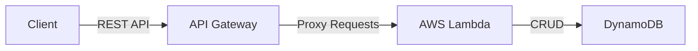

# Compute Services: ECS, Fargate, ECR, EKS

## ECS - Elastic Container Service
Amazon ECS is a fully managed container orchestration service that simplifies the deployment, management, and scaling of Docker containerized applications on AWS. It abstracts away the complexity of managing the underlying infrastructure, allowing developers to focus on building applications

### Key Components
- **Task Definition**: A JSON file that acts as a blueprint for your application, specifying the Docker image, CPU and memory requirements, ports, and other configurations for one or more containers.
- **Task**: A running instance of a task definition
- **Service**: A mechanism for running and maintaining a specified number of identical tasks simultaneously. It ensures application availability by automatically restarting failed tasks and can integrate with load balancers and handle auto-scaling.
- **Cluster**: A logical grouping of resources (either EC2 instances or Fargate capacity) where your tasks and services run.

### Compute Options
Amazon ECS offers several ways to run your containers
- **AWS Fargate (serverless)**: This is the easiest way to run containers, as AWS manages the underlying servers and cluster infrastructure for you. You only pay for the vCPU and memory resources your containers use.
- **Amazon EC2 launch type**: This option gives you full control over the underlying EC2 instances that host your containers, including instance type and operating system customization. You are responsible for managing and scaling the instances.
- **Amazon ECS Anywhere**: This feature allows you to run and manage container workloads on your own on-premises servers or virtual machines using the same ECS control plane, providing a consistent hybrid cloud experience.

### Key Features and Integrations
- **Integration with AWS Services**: ECS has deep, native integration with other AWS services like ELB for traffic distribution, Amazon VPC for network isolation, Amazon ECR for storing images and Amazon CloudWatch for monitoring and logging.
- **Scalability and Availability**: ECS services can automatically scale the number of running tasks based on demand metrics like CPU or memory utilization. The service scheduler also maintains the desired task count to ensure high availability.
- **Networking**: Amazon ECS Service connect simplifies service-to-service communication by providing easy service discovery and traffic management within your ECS environment.
- **Deployment Options**: ECS support rolling updates and blue/green deployment strategies to help you minimize downtime when updating applications
- **AWS ECS Express Mode**: A simplified deployment option that automatically sets up the required infrastructure with production-ready defaults, ideal for quickly launching applications with minimal configuration.

---

## AWS Fargate
AWS Fargate is a serverless compute engine for containers that works with Amazon ECS or Amazon EKS to deploy and manage applications without managing underlying EC2 server infrastructure. It automates provisioning, scaling, and infrastructure management, letting you run containers by defining CPU and memory needs, with security-focused task-level isolation.

### How Fargate works
- **Serverless Operation**: Fargate eliminates the need to select instance types, patch operating systems, or scale cluster capacity.
- **Integration with ECS/EKS**: You define your container images, CPU, and memory requirements. Fargate handles the infrastructure beneath these services.
- **Task-Level Isolation**: Each container runs in its own isolated environment, enhancing security.
- **Flexible Capacity**: Fargate can be used exclusively or mixed with EC2 instances in the same ECS cluster.
- **Pay-as-you-go**: You are charged for the vCPU and memory resources consumed by your containerized applications, rather than by the EC2 instance.

### Workflow of a Fargate Task
1. **Define*: Create a task definition specifying the container image, CPU, memory and networking.
2. **Launch**: Use ECS or EKS ti run the task or service
3. **Provision** Fargate automatically provisions the necessary compute capacity
4. **Execute & Scale**: Fargate runs the container, and automatically adjusts resources for traffic changes.
5. **Clean Up**: Once the application completes it task, Fargate stops and removes the resource footprint.

---

## AWS EKS
Amazon Elastic Kubernetes Service is a fully managed service that simplifies running Kubernetes on AWS without needing to install, operate, or maintain your own Kubernetes control plane. EKS automatically managed availability, scaling and security across multiple availability zones, supporting both EC2 instances and serverless AWS Fargate for worker nodes.

### Key Features and Benefits
- **Managed Control Plane**: EKS handles the master nodes, patching, and upgrades, ensuring high availability
- **Flexible Compute Options**: Choose between EC2 for full control or AWS Fargate for serverless, node-free infrastructure
- **Security & Compliance**: Integrates with AWS IAM for authentication, VPCs for isolation, and meets security compliance standards.
- **Hybrid Cloud Support**: EKS can run on-promises with Amazon EKS anywhere and EKS Hybrid nodes, allowing consistent Kubernetes management outside of AWS.
- **Native AWS Integration**: Works seamlessly with tools like Amazon CloudWatch, Elastic Load Balancing and AWS.

---

## AWS Lambda
AWS Lambda is a serverless compute service that allows you to run code without provisioning or managing servers. You simply upload your code, and AWS handles all the underlying infrastructure, including capacity provisioning, automatic scaling and maintenance.

### Key Features
- **Serverless**: You don't need to worry about the underlying servers, operating systems or patching.
- **Event-Driven**: Functions execute only when triggered by events, such as HTTP requests via Amazon API Gateway, file uploads to S3, or database changes in Amazon DynamoDB
- **Automatic Scaling**: AWS Lambda automatically scales to match the rate of incoming requests, from a few per day to thousands per second, with no manual configuration required.
- **Cost-Effective**: You pay only for the compute time your code consumes, measured in milliseconds, and the number of requests. There is no charge when your code is not running. 
- **Language Support**: It natively support popular programming languages, including node.js, Python, Java, Go, Ruby, and C# and also allows for custom runtimes.

## Amazon API Gateway
Amazon API Gateway is a fully managed AWS service that makes it easy for developers to create, publish, maintain, monitor and secure APIs at scale. It acts as the "front door" for applications to access logic or functionality from backend services, such as AWS Lambda functions, Amazon EC2, or any web application.

- Serverless and scalable
- Supports RESTful APIs and WebSocket APIs
- Support for security, user authentication, API throttling, API keys, monitoring.

---

## AWS Batch
- Fully managed batch processing at any scale
- Efficiently run 100,000s of computing batch jobs on AWS
- A "batch" job is a job with a start and an end
- AWS Batch provisions the right amount of compute / memory
- YOu submit or schedule batch jobs and AWS Batch does the rest
- Batch jobs are defines as Docker Images and run on ECS
- Helpful for cost optimizations and focusing less on the infrastructure

### Batch vs Lambda
- Lambda
  - Time Limit (15m)
  - Limited runtimes
  - Limited temporary disk space
  - Serverless
- Batch
  - No time limit
  - Any runtime as long as it's packaged as a Docker Image
  - Rely on EBS / instance store for Disk Space
  - Relies on EC2 (can be managed by AWS)

---
## AWS Lightsail
- Virtual servers, storage, databses and networking
- Low & predictable pricing
- Simpler alternative to using EC2, RDS, ELB, RBS, Route 53
- Great for people with little cloud experience
- Can setup notifications and monitoring for your lightsail resources
- Use cases:
  - Simple web applications (has templates for LAMP, Nginx, MEAN, Node.js)
  - Websites (templates for Wordpress, Magento, Plesk, Joomla)
  - Dev / Test environments
- Has high availability but no auto-scAling, limited AWS integrations