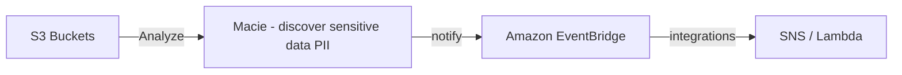

# Security & Compliance

## AWS Shared Responsibility Model
- AWS Responsibility - Security of the cloud
  - Protecting Infrastructure (hardware, software, facilities, and networking) that runs all the AWS services
  - managed service like S3, DynamoDB, RDS, etc.
- Customer Responsibility - Security in the Cloud
  - For EC2 instance, customer is responsible for management of the guest OS (including security patches & updates), firewall & network configuration, IAM
  - Encrypting application data
- Shared Controls:
  - Patch Management, Configuration Management, Awareness & Training.

### Example: RDS
- AWS Responsibility
  - Manage the underlying EC2 instance, disable the SSH access
  - Automated DB patching
  - Automated OS patching
  - Audit the underlying instance and disks & guarantee it functions
- Your Responsibility
  - Check the ports / IP / security group inbound rules in DB's SG
  - in-database user creation and permissions
  - Creating database with or without public access
  - Ensure parameter groups or DB is configured to only allow SSL connections
  - Database encryption setting

### Example: S3
- AWS responsibility:
  - Guarantee you get unlimited storage
  - Guarantee you get encryption
  - Ensure separation of the data between different customers
  - Ensure AWS employees can't access your data
- Your responsibility
  - Bucket configuration
  - Bucket policy / public setting
  - IAM user and roles
  - Enabling encryption

---

## DDoS Protection on AWS

- *AWS Shield standard*: Protects against DDoS attack for your website and applications, for all customers at no additional costs
- *AWS Shield Advanced*: 24/7 premium DDoS protection
- *AWS WAF*: Filter specific requests based on rules
- *CloudFront and Route53*: 
  - Availability protection using global edge network
  - Combined with AWS Shield, provides attach mitigation at the edge

### AWS Shield
- AWS Shield Standard
  - Free service that is activated for every AWS customer
  - Provides protection from attacks such as SYN/UDP Floods, Reflection attacks and other layer 3/layer 4 attacks
- AWS Shield Advanced
  - Optional DDoS mitigation service ($3000 per month per organization)
  - Protect against more sphesticated attack on Amazon EC2, Elastic Load Balancing, CloudFront, AWS Global Accelerator and Route 53
  - 24/7 access to AWS DDoS response team (DRP)
  - Protect against higher fees during usage spikes due to DDoS

### AWS WAF
- Protects your web applications from common web exploits (Layer 7)
- Layer 7 is HTTP (vs Layer 4 is TCP)
- Deploy omn ALB, API GW, CloudFront
- Define Web ACL
  - Rules can include IP addresses, HTTP headers, HTTP body or URI strings
  - Protects from common attack - SQL injection and cross-site scripting (XSS)
  - Size constraints, geo-match (block countries)
  - Rate-based rules (to count occurrences of events) - for DDoS protection

---

## AWS Network Firewall
- Protect your entire Amazon VPC
- From Layer 3 to Layer 7 protection
- Any direction, you can inspect
  - VPC to VPC traffic
  - Outbound to internet
  - Inbound from internet
  - To / from Direct connect * Site-to-Site VPN

---

## AWS Firewall Manager
- Manage security rules in all accounts of an AWS Organization
- Security policy: common set of security rules
  - VPC security Groups for EC2, Application Load Balancer, etc.
  - WAF rules
  - AWS Shield Advanced
  - AWS Network Firewall
- Rules are applied to new resources as they are created across all and future accounts in your organization.

---

## Penetration Testing on AWS Cloud
- AWS customers are welcome to carry out security assessments or penetration tests aganist their AWS infrastructure without prior approval for 8 services:
  - EC2, NAT GW, ELB
  - RDS
  - CloudFront
  - Aurora
  - API GW
  - Lambda and Lambda Edge functions
  - Lightsail resources
  - Elastic Beanstalk environments

- Prohibited Activities:
  - DNS zone walking via Amazon Route 53 Hosted Zones
  - Denial of Service (DoS), Distributed Denial of Service (DDoS), Simulated DoS, Simulated DDoS
  - Port flooding
  - protocol flooding
  - Request flooding (login / API )

---

## AWS KMS
- KMS = AWS managed the encryption keys for us
- Encryption Opt-in:
  - EBS volumes: encrypt volumes
  - S3 buckets: Server-side encryption of objects
  - Redshift database: encryption of data
  - RDS database: encryption of data:
  - EFS drives: encryption of data
- Encryption automatically enabled:
  - CloudTrail Logs
  - S3 Glacier
  - Storage Gateway

## Cloud HSM
- KMS => AWS manages the software for encryption
- CloudHSM => AWS provides encryption hardware
- Dedicated Hardware (HSM - Hardware Security Module)
- You manage your own encryption keys entirely (not AWS)
- HSM device is tamper resistant, FIPS I40-2 Level 3 compliance

### Types of KMS Keys
- Customer Managed Key:
  - Create, manage and used by the customer, can enable or disable
  - Possibility of rotation policy (new key generated every year, old key preserved)
  - Possibility to bring-your-own-key
- AWS Managed Key
  - Created, managed and used on the customer's behalf by AWS
  - Used by AWS services (S3, EBS, Redshift)
- AWS Owned Key:
  - Collection of CMKs that an AWS service owns and managed to use in multiple accounts
  - AWS can use those to protect resources in your account
- CloudHSM Keys (custom keystore):
  - Keys generated from your own CloudHSM hardware device
  - Cryptographic operations are performed within the CloudHSM cluster
---

## AWS Certificate Manager (ACM)
- Let's you easily provision, manage and deploy SSL/TLS Certificates
- Used to provide in-flight encryption for websites (HTTPS)
- Supports both public and private TLS certificates
- Free of charge for public TLS Certificates
- Automatic TLS certificate renewal
- Integrates with 
  - Elastic Load Balancer
  - CloudFront Distributions
  - APIs on API Gateway

---

## AWS Secrets Manager
- Used for storing secrets
- Capability to force rotation of secrets every X days
- Automate generation of secrets on rotation (used Lambda)
- Integration with Amazon RDS (MySQL, PostgreSQL, Aurora)
- Secrets are encrypted using KMS
- Most meant for RDS Integration

---

## AWS Artifact
- Portal that provides customers with on-demand access to AWS Compliance documentation and AWS agreements
- *Artifact Reports*: Allows you to download AWS security and compliance documents from third-party auditors, like AWS ISO certifications, Payment Card Industry (PCI), and System and Organizational Control (SOC) reports
- *Artifact Agreements*: Allows you to review, accept, and track the status of AWS agreements such as Business Associate Addendum (BAA) or the Health Insurance Portability and Accountability Act (HIPAA) for an individual account or in your organization
- Can be used to support internal audit or compliance.

---

## Amazon GuardDuty
- Intelligent Threat discovery to protect your AWS Account
- Used Machine Learning algorithms, anomaly detection, 3rd party data
- One click to enable (30 days trail), no need to install software.
- Input data:
  - *CloudTrail Event Logs* - unusual API calls, unauthorized deployments
    - CloudTrail Management Events - Create VPC subnets, create trail...
    - CloudTrail Data Events: get object, list objects, delete objects
  - *VPC Flow logs* - unusual internal traffic, unusual IP address
  - *DNS Logs* - compromised EC2 instances sending encoded data within DNS queries
  - *Optional Features* - EKS audit logs, RDS & Aurora, EBS, Lambda, S3 data events...
- Can setup EventBridge Rules to be notified in case of findings
- EventBridge rules can target AWS Lambda or SNS
- Can protect against CryptoCurrency attacks.

---
## Amazon Inspector
- Automated security Assessments
- For EC2 instances
  - Leveraging the AWS system manager (SSM) agent
  - Analyze against unintended network accessibility
  - Analyze the running OS against known vulnerabilities.
- For Container images push to Amazon ECR
  - Assessment of container images as they are pushed
- For Lambda Functions
  - Identifies software vulnerabilities in function code and package dependencies
  - Assessment of functions as they are deployed.
- Reporting & Integration with AWS Security HUB
- Send findings to Amazon Event Bridge 

---

## AWS Config
- Helps with auditing and recording compliance of your AWS resources
- Helps record configurations and changes over time
- Possibly of storing the configuration data into S3 (analyzed by Athena)
- Questions that can be solved by AWS Config
  - IS there unrestricted SSH access to my security groups?
  - Do my buckets have any public access
  - How has my ALB configuration changed over time?
- You can receive alerts (SNS notifications) for any changes
- AWS Config is a per-region service.
- Can be aggregated across regions and accounts.

---

## Amazon Macie
- Amazon Macie is a fully managed data security and data privacy service that uses machine learning and pattern matching to discover and protect your sensitive data in AWS
- Macie helps identify and alert you to sensitive data, such as personally identifiable information (PII)

---

## AWS Security Hub
- Central security tool to manage security across AWS accounts and automate security checks
- Integrated dashboards showing current security and compliance status to quickly take actions
- Automatically aggregates alerts in predefined ot personal findings formats from various AWS services & AWS partner tools
  - Config
  - GuardDuty
  - Inspector
  - Macie
  - IAM Access Analyzer
  - AWS Systems Manager
  - AWS Firewall Manager
  - AWS Health
  - AWS Partner Network Solutions
- Must first enable the AWS Config service

---

## Amazon Detective
- GuardDuty, Macie, Security Hub are used to identify potential security issues, or findings
- Sometimes security findings require deeper analysis to isolate the root cause and take action - it's a complex process
- Amazon Detective analyzes, investigates and quickly identifies the root cause of security issues ot suspicious activities (using ML and graphs)
- Automatically collects and processes events from VPC flow logs, cloudtrail, guardduty and create unified view.
- Produces visualizations with details and context to get to the root cause.

---

## AWS Abuse
- Report suspected AWS resources used for abusive or illegal purposes
- Abusive & prohibited behaviors are:
  - *Spam*: receiving undesired emails from AWS-owned IP addresses, websites & forums spammed by AWS resources
  - *Port Scanning*: sending packets to your ports to discover the unsecured ones.
  - *DoS & DDoS attacks*: AWS-owned IP addresses attempting to overwhelm or crash your servers/softwares.
  - *Intrusion Attempts*: logging in on your resources.
  - *Hosting objectionable or copyrighted content*: distributing illegal or copyrighted content without consent
  - *Distributing malware*: AWS resources distributing softwares to harm computers or machines.

---
## Root User Privileges
- Root user = Account Owner (created when the account is created)
- Has complete access to all AWS services and resources
- Lock away your AWS account root user access keys
- Do not use the root account for everyday tasks, even administrative tasks
- Actions that can be performed only by the root user:
  - Change account settings
  - View certain tax invoices
  - Close your AWS account
  - Restore IAM user permissions
  - Change or cancel your AWS support plan
  - Register as a seller in the Reserved Instance Marketplace
  - Configure an Amazon S3 bucket to enable MFA
  - Edit delete Amazon S3 bucket policy that includes an invalid VPC ID or VPC endpoint ID
  - Signup for GovCloud

---

## IAM Access Analyzer
- Find out which resources are shared externally
  - S3 buckets
  - IAM roles
  - KMS Keys
  - Lambda Functions and Layers
  - SQS Queues
  - Secret Manager Secrets
- Define Zone of Trust = AWS Account or AWS Organizations
- Access outside zone of trusts => findings